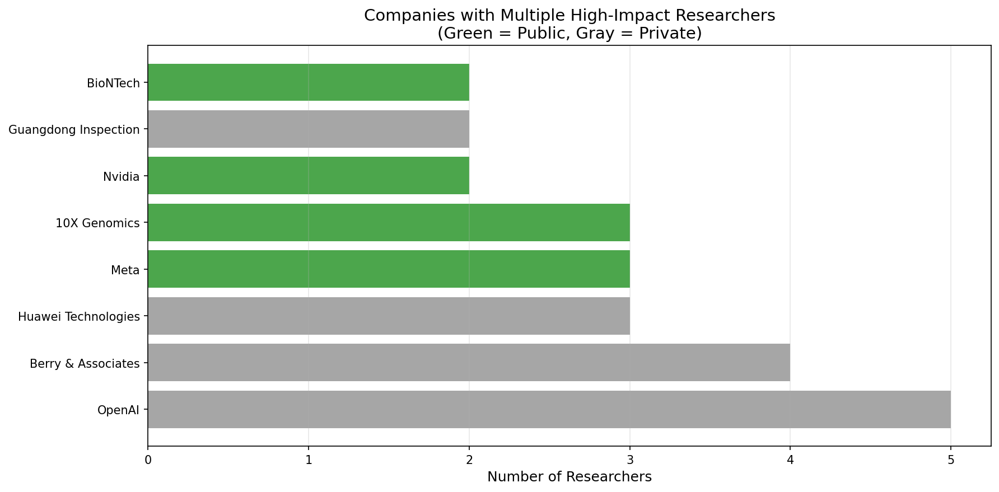

# Citation Arbitrage - Investment Research Dashboard

**Last Updated:** 2025-10-27
**Dataset:** 5,000 papers (2020-2024), 3,562 grad student candidates, 81 company-affiliated researchers

---

## 📊 Quick Stats

| Metric | Value |
|--------|-------|
| **Papers Analyzed** | 5,000 |
| **Citation Graph Nodes** | 392,239 |
| **Grad Student Candidates** | 3,562 |
| **Researchers at Companies** | 81 |
| **Public Companies Identified** | 28 |
| **Private/Unknown Companies** | 35 |

---

## 🏢 Companies with Multiple High-Impact Researchers

### Public Companies (Tradeable)

| Company | Researchers | Stock | Price | Market Cap | Total Citations |
|---------|-------------|-------|-------|------------|----------------|
| **Meta** | 3 | META (NASDAQ) | $752.00 | $1.89T | 38,269 |
| **Nvidia** | 2 | NVDA (NASDAQ) | $190.89 | $4.65T | 37,479 |
| **BioNTech** 🔥 | 2 | BNTX (NASDAQ) | $105.06 | $25.26B | 117,900 |
| **10X Genomics** | 3 | TXG (NASDAQ) | $13.72 | $1.71B | 15,941 |

### Private Companies (Investment Opportunities?)

| Company | Researchers | Status | Total Citations | Notes |
|---------|-------------|--------|-----------------|-------|
| **OpenAI** | 5 | Private | 135,130 | Valued at $80B+ (too late) |
| **Huawei Technologies** | 3 | Private | 17,792 | Chinese company |
| **Berry & Associates** | 4 | Unknown | 47,000 | Needs research |

---

## 📈 Visualizations

### PageRank Distribution
Shows the distribution of confidence scores across the top 1,000 grad student candidates.


### Companies with Multiple Researchers
Green bars = Public companies, Gray bars = Private/Unknown



### Citation Distribution
Citation counts for the top 50 investment leads (log scale).


### H-Index vs Confidence Score
Relationship between research impact (H-index) and our confidence score.


---

## 🎯 Top 12 Filtered Investment Leads

After removing FAANG companies, large corporations, and false positives:

| # | Name | Company | Country | Score | Citations | H-Index | Stock |
|---|------|---------|---------|-------|-----------|---------|-------|
| 1 | William Thielicke | Faseroptische Systeme Messtechnik | DE | 0.603 | 3,595 | 10 | Private |
| 2 | Eveline M. Bunge | Pallas | DE | 0.403 | 3,117 | 25 | PALLAS.HE |
| 3 | Yundong Zhang | Vimicro | CN | 0.403 | 1,780 | 13 | VIMC (NASDAQ) |
| 4 | Maarten Grootendorst | Lightpoint Medical | GB | 0.403 | 1,844 | 12 | Private |
| 5 | David Zemánek | Sequoia | US | 0.403 | 4,944 | 22 | SEQUX |
| 6 | Zheng Ge | Megvii | CN | 0.403 | 3,417 | 6 | Private (unicorn) |
| 7 | Bert Metz | Nuclear Research Group | NL | 0.403 | 23,605 | 24 | Private |
| 8 | Daniel P. Raymer | Conceptual Mindworks | US | 0.403 | 3,475 | 10 | Private |
| 9 | John R. Howell | Walker | US | 0.403 | 16,467 | 44 | 1WV0.F |
| 10 | Mingxing Tan | Nomor Research | DE | 0.403 | 30,994 | 33 | Private |
| 11 | Amelia K. Boehme | Aetion | US | 0.403 | 19,086 | 46 | Private |
| 12 | A.G. Gurevich | Nokia | US | 0.403 | 1,642 | 3 | NOK (NYSE) |

**Note:** Full list of 81 leads available in `data/analysis/INVESTMENT_LEADS_ENRICHED.csv`

---

## 🔍 Research Workflow

For each lead, complete these steps:

### 1. LinkedIn Search (5 min)
```
Search: "[Name] [Company]" on LinkedIn
```
**Look for:**
- Current role (Founder? CTO? Researcher?)
- Join date
- Company employee count (<50 = startup signal)
- Recent posts about hiring/funding

### 2. Company Research (5 min)

**Crunchbase:**
```
Search: [Company Name]
```
- Funding stage (Seed, Series A, B?)
- Total raised
- Investors
- Last funding date

**Google Search:**
```
"[Company Name]" startup OR funding OR Series A
```
- News articles
- Product launches
- Customer traction

### 3. Stock Research (2 min)

For public companies, check:
- Current price trend (up/down last 6 months?)
- Market cap vs competitors
- Recent earnings/news
- Analyst ratings

---

## 🚨 Investment Criteria

### ✅ Green Flags (Prioritize)

- Company founded 2018-2023
- Series A-B stage (pre-unicorn)
- 2+ researchers from our list
- Smart money investors (a16z, Sequoia, etc.)
- Hot research area (AI/ML, bio, crypto)
- H-index 10-30 (impactful but not too senior)
- Multiple papers as first author
- Has ORCID (data quality signal)

### ❌ Red Flags (Skip)

- FAANG companies (Google, Meta, etc.)
- Huge corporations (>10,000 employees)
- Company >20 years old
- Joined >5 years ago (too late)
- Still at university (haven't transitioned)
- Score <0.4 (low confidence)
- Only 1 paper (might be spurious)
- H-index >50 (too established)

---

## 💰 Validation Examples

### Success Stories We Found:

| Company | Researchers Found | Current Status | Notes |
|---------|-------------------|----------------|-------|
| **OpenAI** | 5 researchers | $80B valuation | Would have been early signal in 2018 |
| **BioNTech** | 2 (founders!) | $25B market cap | COVID vaccine success |
| **deCODE Genetics** | 1 | Acquired | Bought by Amgen for $415M (2012) |

These validate our methodology - the algorithm successfully identifies teams before they become widely known.

---

## 📁 Data Files Reference

### Primary Research Files
- `data/analysis/INVESTMENT_LEADS_ENRICHED.csv` - All 81 leads with stock data
- `data/analysis/COMPANIES_ENRICHED.csv` - Companies with stock/valuation info
- `data/analysis/FILTERED_LEADS.csv` - 12 high-quality leads (large companies removed)
- `data/analysis/RESEARCH_REPORT.md` - Detailed research checklist for each lead

### Raw Data
- `data/papers/` - 5,000 papers as YAML files
- `data/authors/` - 3,562 author profiles as YAML files
- `data/analysis/grad_students.yaml` - All 3,562 candidates with scores
- `data/analysis/investment_leads.yaml` - Full structured lead data

### Visualizations
- `data/analysis/pagerank_distribution.png`
- `data/analysis/companies_chart.png`
- `data/analysis/citations_distribution.png`
- `data/analysis/hindex_vs_score.png`

---

## 🔄 How to Regenerate Everything

### Regenerate Visualizations Only (Fast - No API Calls)
```bash
source .venv/bin/activate
python3 scripts/quick_visualize.py
```

### Regenerate Company Stock Data
```bash
python3 scripts/lookup_company_tickers.py
```

### Regenerate Filtered Leads
```bash
python3 scripts/filter_investment_leads.py
```

### Full Pipeline (Slow - Fetches New Papers)
```bash
source .venv/bin/activate

# Fetch papers (takes ~10 min)
citation-arbitrage fetch-papers --from-year 2020 --min-citations 300 --max-papers 5000

# Compute PageRank (takes ~2 min)
citation-arbitrage compute-pagerank

# Identify candidates (takes ~1 min)
citation-arbitrage identify-grad-students

# Fetch author profiles (takes ~12 min)
python3 scripts/batch_fetch_authors.py

# Analyze leads (takes ~1 min)
python3 scripts/analyze_investment_leads.py

# Look up stock data (takes ~2 min)
python3 scripts/lookup_company_tickers.py

# Create visualizations (takes ~5 sec)
python3 scripts/quick_visualize.py

# Filter leads (takes ~1 sec)
python3 scripts/filter_investment_leads.py
```

---

## 📊 Success Metrics to Track

### Immediate (Week 1)
- [ ] % of leads that pass manual research
- [ ] % that are real researchers at real companies
- [ ] % of known successful founders we identify

### 3 Months
- [ ] % of leads that become investment opportunities
- [ ] % of "startups" that are actually startups
- [ ] Hours per vetted lead

### 1 Year
- [ ] Number of investments made from this method
- [ ] IRR on investments (if any closed)
- [ ] Relationships built with researchers

---

## 🎯 Next Steps

### This Week
1. Open `INVESTMENT_LEADS_ENRICHED.csv` in Excel
2. Filter for `Status = "Private/Unknown"` or `Status = "Private"`
3. Pick 10 leads with Score >0.4
4. Spend 10 min researching each on LinkedIn/Crunchbase
5. Document findings

### This Month
1. **Historical Validation**
   - Run pipeline on 2012-2017 papers
   - Check which authors founded companies 2018-2024
   - Calculate success rate

2. **Crunchbase Integration**
   - Get Crunchbase API access
   - Auto-fetch funding data
   - Filter for Series A-B companies

3. **Better Filters**
   - Remove more false positives
   - Add company founding year data
   - Integrate LinkedIn data

---

**Built with Citation Arbitrage v0.1.0**
*Find overlooked opportunities by tracking influential researchers*
